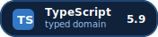
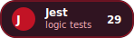

<div align="center">
  
  <h1>EloCoach</h1>
  <p><strong>Overlay desktop em Electron + TypeScript para apoio tatico em partidas competitivas.</strong></p>
  <p>League of Legends e o primeiro modelo de dominio, com simulacao offline para demonstracao em portfolio.</p>

  <p>
    
    
    
    
  </p>

  <p>
    
    
    
    
  </p>
</div>

O projeto nasceu como um experimento antigo com Electron e foi retomado como estudo de produto, arquitetura e regras de negocio para apps sobrepostos a jogos. A versao atual prioriza funcionamento demonstravel sem o jogo instalado, tipagem consistente e uma base expansivel para novos provedores de dados.

## O que o app faz

- Renderiza um HUD transparente e compacto sobre a tela.
- Mantem a janela em modo click-through por padrao, evitando capturar clique durante a partida.
- Ativa modo edicao com `Ctrl+Shift+E` para mover widgets com seguranca.
- Consome dados reais pela Riot Live Client API quando o LoL esta rodando.
- Oferece `start:demo` com provider mockado para demonstracao offline.
- Calcula estado de sessao, relogio de waves, risco de gank e contexto de objetivos.
- Exibe status operacional quando os dados do jogo estao indisponiveis, pausados ou incompletos.

## Por que este projeto existe

Este repositorio esta sendo enriquecido como peca de portfolio. A ideia nao e vender uma ferramenta pronta para uso competitivo, mas mostrar decisoes tecnicas reais em um produto com restricoes interessantes:

- overlay nao pode atrapalhar o input do jogador;
- dados locais do jogo podem estar indisponiveis ou incompletos;
- a UI precisa ser densa, legivel e pequena;
- regras de negocio devem considerar tempo de partida, telemetria incerta e fases do jogo;
- o projeto precisa funcionar em modo demo para avaliacao sem League of Legends instalado.

## Destaques tecnicos

- **Electron como tecnologia central:** janela transparente, always-on-top, click-through e integracao entre processo principal, preload e renderer.
- **TypeScript de ponta a ponta:** contratos compartilhados entre provider, dominio, IPC e HUD.
- **Simulacao offline:** provider mockado para demonstrar uma partida sem depender do League of Legends instalado.
- **Logica tatico-competitiva:** heuristicas para risco de gank, timers de objetivos, rotacoes, matchups e sinais de mapa.
- **Base testavel:** regras de negocio isoladas da UI e cobertas por Jest.

## Stack

| Icone | Tecnologia | Papel no projeto |
| --- | --- | --- |
|  | **Electron / Electron Forge** | Base do app desktop, empacotamento, janela transparente e overlay sobre o jogo. |
|  | **TypeScript** | Tipagem dos contratos, providers, regras de negocio e renderer. |
|  | **Webpack** | Bundles do processo principal, preload e renderer via Electron Forge. |
|  | **Jest** | Testes unitarios das heuristicas e modelos de dominio. |
|  | **ESLint** | Qualidade e consistencia do codigo TypeScript. |
|  | **Node.js** | Runtime do processo principal e integracao com APIs locais. |
|  | **HTML/CSS** | HUD compacto, legivel e pensado para nao atrapalhar a partida. |
|  | **Interact.js** | Arraste e ajuste dos widgets no overlay. |
|  | **Riot Live Client API** | Fonte local de dados quando o LoL esta em execucao. |

## Como rodar

Instale as dependencias:

```bash
npm install
```

Rodar tentando usar a API local do LoL:

```bash
npm run start
```

Rodar em modo demo offline:

```bash
npm run start:demo
```

Empacotar:

```bash
npm run package
```

Testes:

```bash
npm test
```

Lint:

```bash
npm run lint
```

## Controles

- Arraste os widgets pela borda do HUD.
- O conteudo do overlay permanece click-through para nao interceptar cliques durante a partida.
- `Ctrl+Shift+E` alterna um modo de edicao/diagnostico para inspecao do overlay.

## Arquitetura

```text
src/
  contracts/   Tipos compartilhados entre main, preload, renderer e dominio
  logic/       Regras de negocio, heuristicas e modelos testaveis
  providers/   Fontes de dados reais ou mockadas
  index.ts     Processo principal do Electron
  preload.ts   Ponte IPC tipada e isolada
  renderer.ts  Atualizacao visual do HUD
```

### Providers

`RiotProvider` consulta a Live Client API local. `MockProvider` usa o simulador interno para permitir desenvolvimento, testes e apresentacao do produto sem depender do jogo instalado.

### Logica de dominio

Os modulos em `src/logic` separam a parte testavel do produto:

- `GameSessionTracker`: interpreta estado da partida e confiabilidade do relogio.
- `TacticalEngine`: calcula timers de wave e contexto de minions.
- `ObjectiveTracker`: deriva eventos de objetivos a partir de dados observados.
- `JunglerTracker`: identifica e acompanha o jungler inimigo.
- `GankPredictor`: combina sinais para gerar hipotese e risco.
- `OverlayViewModel`: transforma dados de jogo em um modelo compacto para UI.

## Estado atual

O projeto ja possui:

- demo offline funcional;
- contratos IPC tipados;
- tratamento de telemetria indisponivel;
- HUD compacto com timer de partida, alertas contextuais, objetivos situacionais e sinais de rotacao;
- arraste dos widgets pela borda;
- simulacao mockada para apresentar uma partida sem depender do jogo instalado;
- cobertura de testes para os principais modulos de regra.

## Proximos passos planejados

- Criar mais cenarios mockados para fases diferentes da partida.
- Evoluir a UI para multiplos widgets pequenos e configuraveis.
- Adicionar um painel de diagnostico para explicar a origem dos sinais taticos.
- Separar melhor o dominio por jogo para permitir expansao alem de LoL.
- Documentar decisoes de arquitetura e limitacoes da Riot Live Client API.

O plano de dominio para o MVP esta em [`docs/mvp-simulation-research.md`](docs/mvp-simulation-research.md).

## Aprendizados destacados

- Electron exige cuidado com seguranca, preload e isolamento de contexto.
- Overlay para jogos precisa tratar input como requisito de produto, nao detalhe visual.
- TypeScript ajuda mais quando contratos atravessam processos e fontes de dados.
- Mock provider transforma um projeto dependente de ambiente externo em algo demonstravel.
- Regras de negocio ficam mais sustentaveis quando separadas da UI e cobertas por testes.

## Aviso

EloCoach e um projeto educacional e experimental. Ele nao e afiliado, endossado ou aprovado pela Riot Games.
